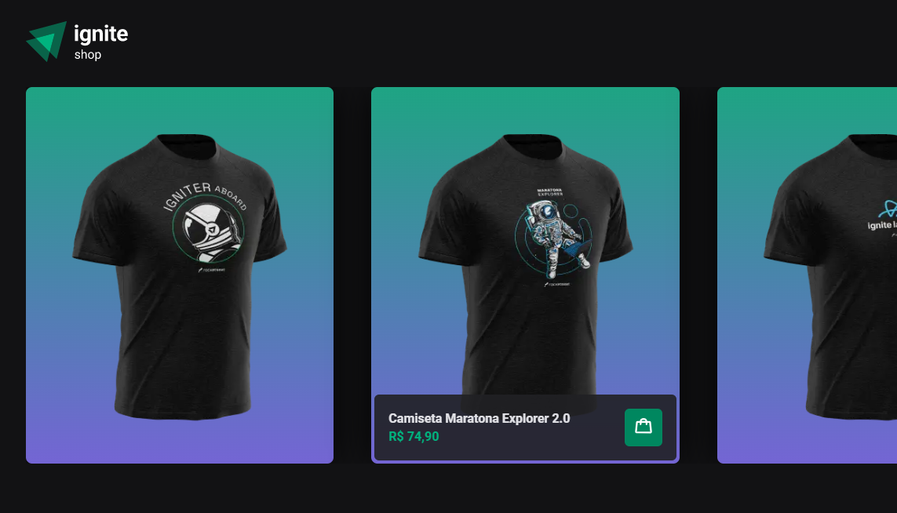

<h1 align="center">Ignite Shop 👔</h1>

  

 
<h2>🛍️ Sobre</h2>

Desafio proposto pela Rocketseat durante o bootcamp Ignite. O Ignite Shop é um e-commerce fictício para venda de camisetas, onde o cliente pode escolher uma ou mais camisetas, adicionar na sacola de compras, informar os dados de pagamento, e visualizar seu pedido feito.

 
<h2>🎯 Objetivo</h2>

Aprender na prática uma nova biblioteca para estilização de páginas: Stitches. Assim como o Styled-componentes, o Stitches é uma ferramenta que utiliza a abordagem CSS-in-JS (CSS escrito com JS, habilitando novas funcionalidades), porém com uma vantagem: Possui uma melhor integração com sites desenvolvidos utilizando Server-side Rendering (Renderização no lado servidor), pois ele é near-zero run time, ou seja, boa parte da estilização será pre-carregada no lado servidor, melhorando a experiência do usuário.   Além disto, neste módulo/desafio, utilizamos a biblioteca NextJS para criar a aplicação, que tem como foco principal alterar a forma que renderizamos nossa aplicação, seja fazendo isto no lado servidor (Server side Rendering), ou criando estaticamente a página no momento da build (Static Site Generation), diferentemente de utilizar React puro, onde a renderização ocorre apenas no Client side. Utilizando o Next, com essas novas formas de renderização, podemos melhorar coisas como performance, disponibilidade e SEO da aplicação.

 
<h2>🛠️ Tecnologias e ferramentas/bibliotecas utilizadas</h2>
<ul>
  <li><a href="https://pt-br.reactjs.org/">React</a></li>
  <li><a href="https://www.typescriptlang.org/">Typescript</a></li>
  <li><a href="https://nextjs.org/">NextJS</a></li>
  <li><a href="https://stitches.dev/">Stitches</a></li>
  <li><a href="https://stripe.com/docs">Stripe</a></li>
  <li><a href="https://www.radix-ui.com/">Radix-UI</a></li>
  <li><a href="https://axios-http.com/ptbr/docs/intro">axios</a></li>
  <li><a href="https://keen-slider.io/">keen-slider</a></li>
</ul>
 
<h2>📌 Funcionalidades/melhorias a serem implementadas</h2>
<ul>
  <li>Utilizar a biblioteca use-shopping-cart para gerenciar a sacola de compras ao invés da Context API</li>
</ul>
 
<h2>🔖 Layout</h2>

Você pode visualizar o layout do projeto através deste link: <a href="https://www.figma.com/file/ladPQbEyuptkEkBUtFa24k/Ignite-Shop-2.0-(Copy)?node-id=0-1">Layout do projeto</a>. É necessário possuir uma conta no <a href="https://figma.com">Figma</a> para acessá-lo.

 
 

Made by Matheus Pazinati 🛸
